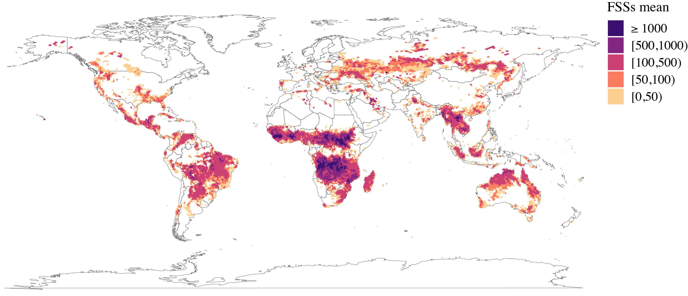

## Global Fire Season Severity Analysis and Forecasting<br>
Leonardo N. Ferreira, Didier A. Vega-Oliveros, Liang Zhao, Manoel F. Cardoso and Elbert E. N. Macau



In this page you find the code used in the paper.  
arXiv: [arxiv.org/abs/1902.03298](https://arxiv.org/abs/1903.06667)

### Code

All the algorithms and experiments used in this paper were implemented using [R](https://www.r-project.org/). [Download](https://github.com/lnferreira/global_fss_analysis_forecasting/archive/master.zip) the code and open the R folder. There are 4 files:

* R/
   * ```fire_season_analysis.R```
      - Methods implementation
   * ```run_example.R```
      - An example of how to use the fire season detection and the forecasting methods
   * ```data_exemple.csv```
      - Data from figure 1 in the paper (India) used in the examples
   * ```R.Rproj```
      - R Studio project file

### Bibtex

If you used this code, please cite our paper.

```
@article{ferreira20,
  Title = {Global fire season severity analysis and forecasting},
  Journal = {Computers & Geosciences},
  Author = {Leonardo N. Ferreira and Didier A. Vega-Oliveros and Liang Zhao and Manoel F. Cardoso and Elbert E.N. Macau},
  Doi = {https://doi.org/10.1016/j.cageo.2019.104339},
  Issn = {0098-3004},
  Pages = {104339},
  Url = {http://www.sciencedirect.com/science/article/pii/S0098300419302808},
  Volume = {134},
  Year = {2020}
}
```

### Contact

If you have questions or sugestions, send us an email:

**Leonardo N. Ferreira**<br>
[ferreira@leonardonascimento.com](mailto:ferreira@leonardonascimento.com)<br>
[leonardoferreira.com](https://leonardoferreira.com)

**Didier A. Vega-Oliveros**<br>
[davo@icmc.usp.br](mailto:davo@icmc.usp.br)<br>
[didiervega.github.io](https://didiervega.github.io/)
